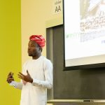

Hi, my name is **Samuel Adeyanju**. I am a PhD student in the Faculty of  Forestry and a Four-Year Doctoral Fellow at the University of British Columbia (UBC), Canada. My PhD work is supervised by Dr. Terry Sunderland. I specialize in the political ecology of natural resource management in Africa. My doctoral research investigates the impact of livelihood intervention strategies on rural communities participating in community based natural resources management programs in Ghana. Prior to starting my PhD, I interned at the United Nations Food and Agriculture Organization HQ in Rome, Italy.

In 2017, I received the prestigious fully funded Mastercard Foundation Scholarship to pursue a Master’s degree in Forestry at the University of British Columbia. My masters thesis on the preservation of sacred forests for biodiversity conservation in Southwest Nigeria was featured on Forbes in 2021. I hold a First-Class Bachelor's degree in Forestry & Wood Technology from the Federal University of Technology, Akure, Nigeria.

I have co-authored 4 peer reviewed journal articles and book chapters, 1 preprint, and delivered 7 national and international conference presentations and received over $200,000 in scholarships, travel and research funding. My research has been published in International Journal of the Commons, International Forestry Review, proceedings of the World Forestry Congress and CIFOR Forest News. I have over four years of experience in climate change advocacy and has participated at high-level UN processes such as UNFCCC COP23, (Bonn 2017), and the 1st UN Secretary-General Youth Climate Summit (New York 2019) to raise advocacy for nature-based solutions and climate justice. I am currently a member of the Advisory Group of the Commonwealth Forestry Association, the United Kingdom.

During my free time, I use social media especially Twitter, watch netflix shows and movies with my wife and hangout with friends
