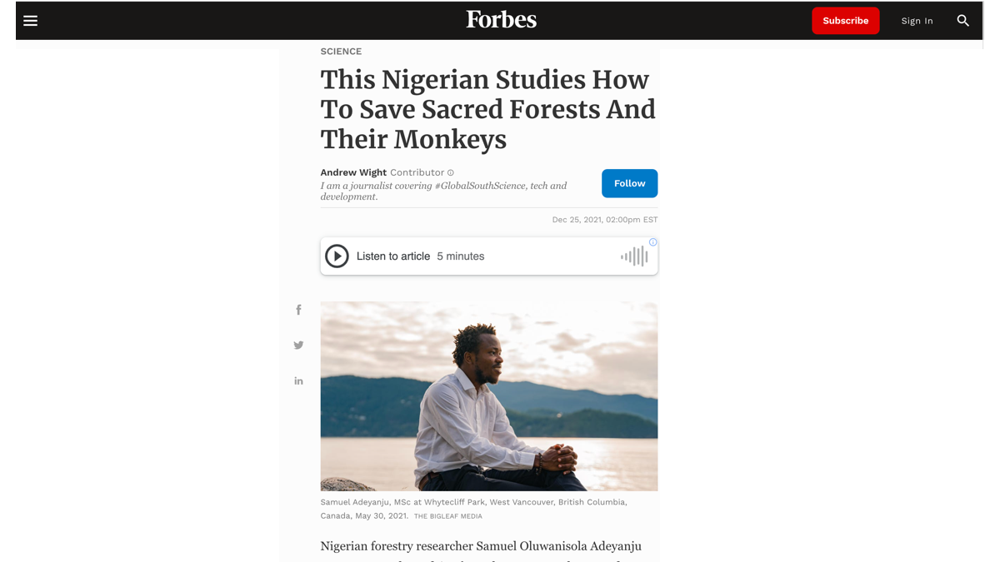

---
title: Publications
---                     

# In the News
1. Interview on **InCommon Podcast**, 6 September, 2022: <a href="https://www.incommonpodcast.org/podcast/ijc7-sacred-groves-or-commons-with-a-difference-with-samuel-adeyanju/=" target="_blank">Sacred Groves (Or Commons with A Difference)</a>. Listen on Apple Podcasts <a href="https://podcasts.apple.com/nz/podcast/ijc-7-sacred-groves-or-commons-with-a-difference/id1462181036?i=1000578560502=" target="_blank">here</a> and YouTube <a href="https://www.youtube.com/watch?v=CjfrIujwqzs&t=59s=" target="_blank">here</a>
2. Covered and quoted by **Landscape News**, 7 April, 2022: <a href="https://news.globallandscapesforum.org/56714/how-sacred-groves-protect-deities-culture-and-biodiversity/=" target="_blank">How sacred groves protect deities, culture and biodiversity</a>.
3. Profile feature and interview by **Forbes**, 25 December, 2021: <a href="https://www.forbes.com/sites/andrewwight/2021/12/25/this-nigerian-studies-how-to-save-sacred-forests-and-their-monkeys/?sh=6967be3839c7=" target="_blank">This Nigerian Studies How to Save Sacred Forests and Their Monkeys</a>.

<h4> For the latest and more complete set of publications, please see my <a href="https://scholar.google.com/citations?user=DJ1LbLUAAAAJ&hl=en&inst=17001591832933267808=" target="blank"> Google Scholar</a> </h4>

# Peer-Reviewed Journals, Book chapters & Conference Paper

1. Reed, J., Ros-Tonen, M.A., Adeyanju, S., Arimiyaw, A.W., Asubonteng, K., Baatuwie, B.N., Bayala, E.R., Tom-Dery, D., Ickowitz, A., Issaka, Y.B., Moombe, K.B., Mumuni, J., Wakesho, G., Zida, M. & Sunderland, T. (2024). From conflict to collaboration through inclusive landscape governance: Evidence from a contested landscape in Ghana. Global Environmental Change, 88, 102909.  <a href="https://doi.org/10.1016/j.gloenvcha.2024.102909" target="blank">Link</a>
   
3. Adeyanju, S., Bulkan, J., Onyekwelu J. C., Peterson St-Laurent, G., Kozak, R., Sunderland, T., Stimm, B. (2022). Drivers of biodiversity conservation in sacred groves: A comparative study of three sacred groves in South-west Nigeria. International Journal of the Commons, 16(1), 94–107. <a href="http://doi.org/10.5334/ijc.1143" target="blank">Link</a>

4. Adeyanju, S., Adesuyi, O., Offiah, C., Fasalejo, O., Ogunlade, B. (2022). Where are the foresters? The influx of forestry graduates to non-forestry jobs in Nigeria. XV World Forestry Congress, 2022. Seoul, Korea. <a href="https://www.researchgate.net/publication/360194133_Where_are_the_foresters_The_influx_of_forestry_graduates_to_non-forestry_jobs_in_Nigeria=" target="blank">PDF</a>.

  5. Adeyanju, S., Ajilore, O., Ogunlalu, O., Onatunji, A., & Mogaji, E. (2022). Innovating in the Face of the COVID-19 Pandemic: Case Studies from Nigerian Universities. In: Chan, R., Glass, C., Bista, K. (eds) Coronavirus (COVID-19) and Global Higher Education: Opportunities and Challenges. STAR Scholar Book Series, 104-120. <a href="https://ojed.org/index.php/gsm/article/view/2823/1567=" target="blank">PDF</a>.
  
6. Adeyanju, S., O'connor, A., Addoah, T., Bayala, E., Djoudi, H., Moombe, K., Reed, J., Ros-Tonen, M., Siangulube, F., Sikanwe, A. and Sunderland, T., (2021). Learning from Community-Based Natural Resource Management (CBNRM) in Ghana and Zambia: lessons for integrated landscape approaches. International Forestry Review 23(3): 273-297. <a href="https://www.ingentaconnect.com/contentone/cfa/ifr/pre-prints/content-ifr213a?crawler=true&mimetype=application/pdf=" target="blank">PDF</a>.
  
7. Adeyanju S., Mogaji E., Olusola J., Oyinlola M. (2020). Factors Influencing Students’ Choice of a Federal University: A Case Study of a Nigerian Federal University. In: Mogaji E., Maringe F., Ebo Hinson R. (eds) Higher Education Marketing in Africa. (pp 135-163). Palgrave Macmillan, Cham. <a href="https://www.researchgate.net/publication/336967885_Factors_Influencing_Students'_Choice_of_a_Federal_University_A_Case_Study_of_a_Nigerian_Federal_University=" target="blank">Link</a>.
  
# Research-Based Op-Eds
  
6. <a href="https://forestsnews.cifor.org/76005/replacing-short-term-projects-with-long-term-processes?fnl=" target="_blank">Adeyanju, S., O'connor, A., (2022) Replacing short-term projects with long-term processes: Lessons learned from CBNRM in Ghana and Zambia. *Forest News*.</a>
  
# Preprints
7. Adeyanju, S. (2021). An Analysis of Students’ Perception of University Sustainability Programs and Image. Preprints, 202107057 <a href="https://www.researchgate.net/profile/Samuel-Adeyanju/publication/353484783_An_Analysis_of_Students'_Perception_of_University_Sustainability_Programs_and_Image/links/6109a618169a1a0103dadc7a/An-Analysis-of-Students-Perception-of-University-Sustainability-Programs-and-Image.pdf=" target="blank">PDF</a>.
  
# Other Writings
8. <a href="https://issuu.com/ubcforestry/docs/bl_29.4/6=" target="_blank">Adeyanju, S. (2018). Advancing education in Africa through the Mastercard Foundation scholar’s program. *UBC Forestry Branchlines*</a>. 
  
9. <a href="https://wiki.ubc.ca/Documentation:Open_Case_Studies/FRST522/A_case_study_on_Bimbia_Bonadikombo_Community_Forest_(BBCF),_South_West_Region_of_Cameroon:_Emergence,_Impacts,_and_Improvements=" target="_blank">Adeyanju, S. (2017a). A case study on Bimbia Bonadikombo Community Forest (BBCF), South West Region of Cameroon: Emergence, Impacts, and Improvements. *Open Case Studies on UBC Wiki*</a>.
  
10. <a href="https://wiki.ubc.ca/Documentation:Open_Case_Studies/FRST522/Illegal_logging_in_the_Republic_of_Congo=" target="_blank">Adeyanju, S. (2017b). Illegal Logging in the Republic of Congo. *Open Case Studies on UBC Wiki*</a>. 
  
11. <a href="https://africaclimatereports.org/2017/11/my-first-day-at-cop-23/=" target="_blank">Adeyanju, S. (2017c). My first day at COP 23 *Africa Climate Reports*</a>.
  
12. <a href="https://africaclimatereports.org/2017/11/al-gore-speaks-on-climate-change-realities-across-the-globe-at-cop23/=" target="_blank">Adeyanju, S. (2017d). COP23: Al Gore speaks on climate change realities across the globe. *Africa Climate Reports*</a>.

