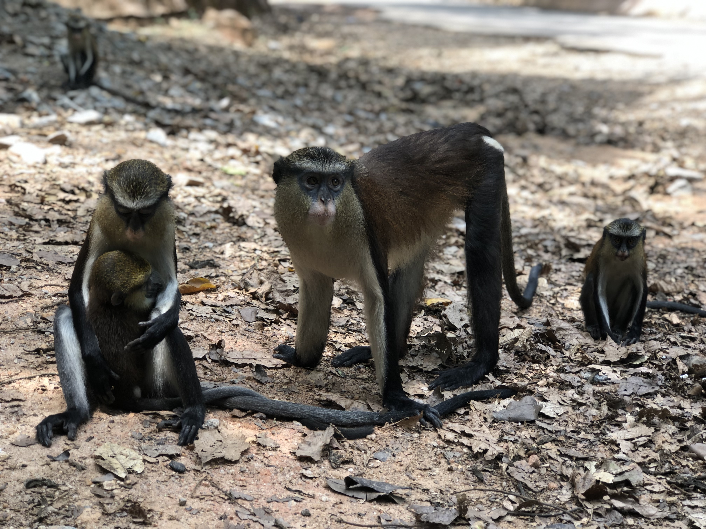

<h1> Current Research </h1>
<h3> Towards poverty reduction in Northern Ghana: Livelihood interventions and community based natural resources management </h3>
    
This is my doctoral research. Please, find below the abstract of the ongoing work
 
 <blockquote> 
    More than two million Ghanaians depend solely on forest resources for their livelihoods, food security and nutrition,
putting pressure on the dwindling natural resources. In 2000, the Ghanaian government introduced a program to
encourage locals to protect the natural resources in their communities and improve their livelihoods. The program is
called Community Resource Management Areas (CREMAs), a geographic area with rich forest and wildlife resources
where communities work together to maintain shared natural resources. Today, CREMAs cover about 400,000 hectares
in over 200 communities in Ghana. Many donor organizations fund the establishment of CREMAs and execute
livelihood interventions. The interventions aim to enhance the livelihoods of Ghanaians by promoting substitute
livelihood activities (e.g., ecotourism) to reduce poverty and overexploitation. My study aims to understand the
effectiveness of livelihood interventions in improving livelihoods within CREMAs by examining how interventions work,
who they work for or exclude, and obstacles to their effective implementation. The study is important for providing
insights to ensure the poor and marginalized, who need livelihood interventions the most, are reached. I will conduct the
research in Northern Ghana- the most vulnerable region to climate change and poorest region in Ghana. I will live in
communities participating in CREMAs for 9 months, conducting individual and group interviews with women, men,
community leaders, and government and NGO staff implementing CREMAs. I will engage and observe residents in
communities and NGO staff implementing livelihood interventions as they do their daily activities. My research will
create a framework that guides the design and implementation of livelihood interventions to utilize the limited resources
available for such interventions more effectively and to reduce poverty in Ghana and other developing countries.
</blockquote>

# Past Research
<h3> Sacred groves and Biodiversity Conservation in Nigeria </h3> 
  
   
   
This was my Masters degree research. Please, find below the abstract of the published work that resulted from my  <a href="https://dx.doi.org/10.14288/1.0389686" target="blank"> **Thesis**</a>.

<blockquote> 
    Globally, sacred groves represent a traditional form of community-based conservation, recognized as areas of cultural and religious importance to local people. In some cases, the entire community guards against the desecration of, or unauthorized access to, such sites, either by its members or outsiders; in others, non-recognition of customary rights is linked to degradation. This paper uses the case study of three sacred groves in southwest Nigeria to examine the extent to which perceived socio-economic and religio-cultural benefits contribute to biodiversity conservation in sacred groves with different scales of governance. Using mixed methods approaches, we found that the long-term preservation of sacred groves and their biodiversity depend on collaboration between: i.) customary institutions (community-based conservation through a system of established traditional norms and prohibitions), and ii.) formal government legislation and management. The recognition of sacred groves as national monuments and UNESCO World Heritage Site has paved the way for biodiversity protection, increasing cultural tourism, socio-economic rewards and the preservation of religio-cultural values. We present local peoples’ assessments of the benefits of sacred groves and offer suggestions to improve community engagement and protect the biodiversity within sacred groves in Nigeria.
</blockquote>

Adeyanju, S. O., Bulkan, J., Onyekwelu, J. C., Peterson St-Laurent, G., Kozak, R., Sunderland, T., & Stimm, B. (2022). Drivers of Biodiversity Conservation in Sacred Groves: A Comparative Study of Three Sacred Groves in Southwest Nigeria. International Journal of the Commons, 16(1), 94–107. DOI: http://doi.org/10.5334/ijc.1143 
